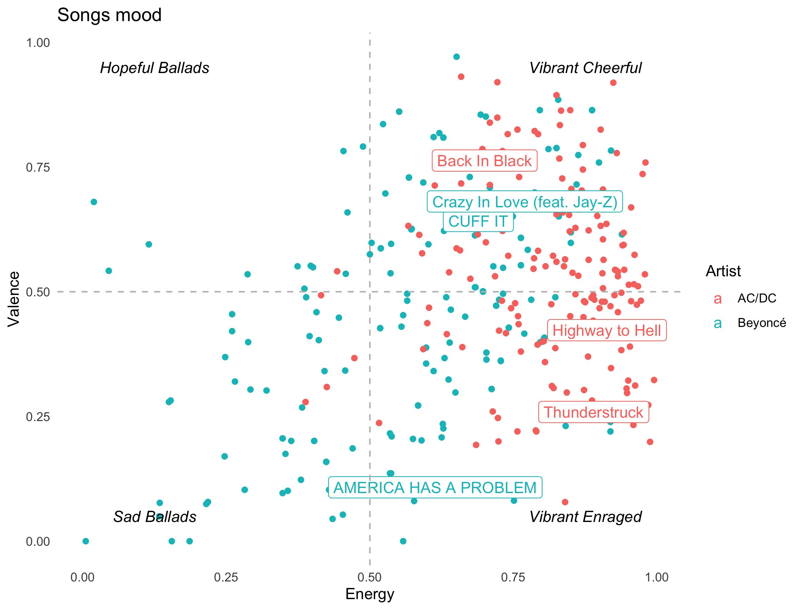
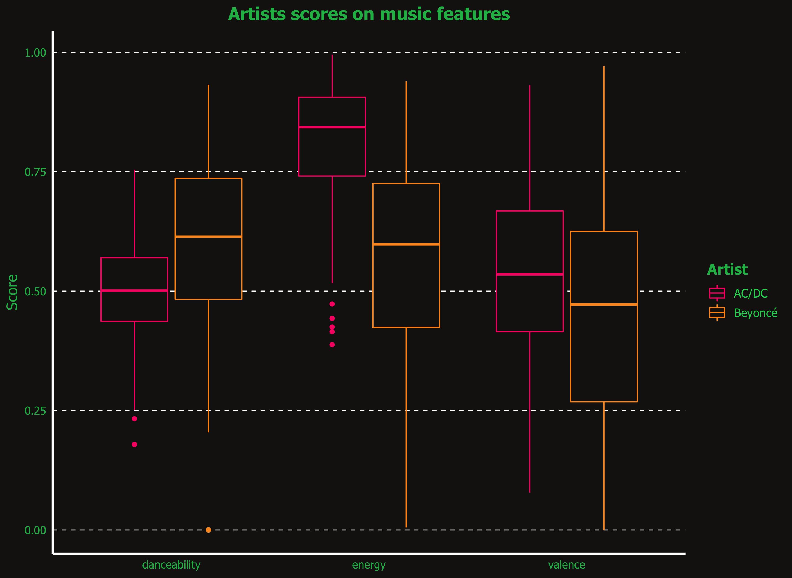
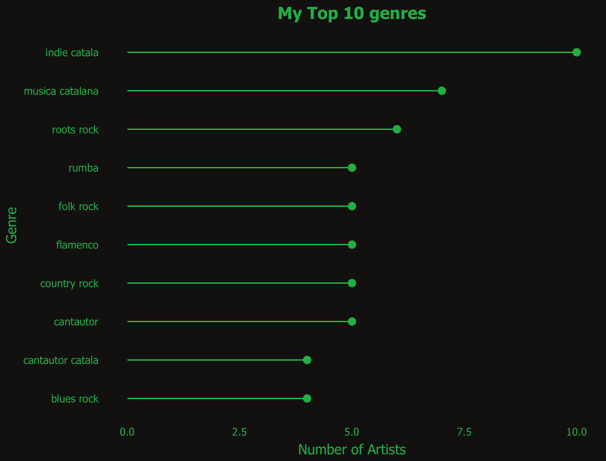
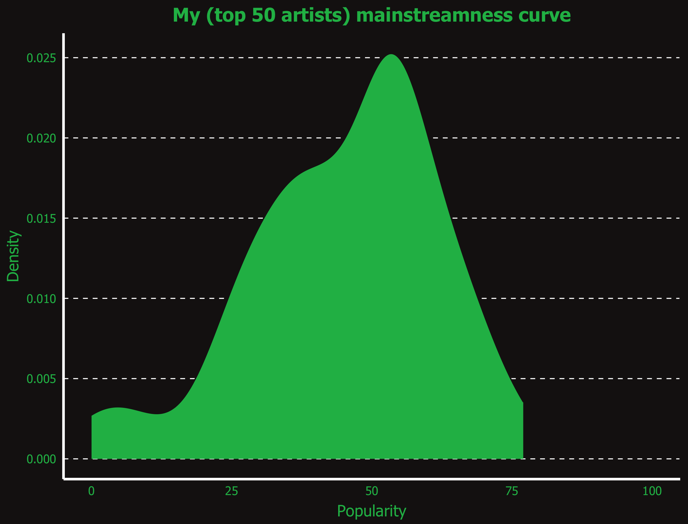

## Before the Workshop

### Requirements

- In order to explore Spotify's data, one must have access to a Spotify account. The subscription type does not matter (free, paid, ...). Make sure to remember your username or email and password.

### Step by step Instructions
#### How to get your Spotify Api keys?

1. Go to [https://developer.spotify.com/dashboard/](https://developer.spotify.com/dashboard/)
2. Log in with your personal Spotify account (scroll down to find the “log in” button if it’s not visible in your screen)
3. Accept the terms (if you agree with them...)
    - Note that some users might face an error “There was an error sending the data try again”. This is something on Spotify's side and there doesn’t seem to be any other solution than re-trying to accept the terms in a few minutes or hours.
5. Once you are in your personal page, click "create an App"
    - You can write whatever App name and description you’d like. This will be linked to the keys we are going to get. Example: “My Spotify Data Visualisations”
7. You can get now you Client Id and Client Secret
8. Go to Edit Setting in your app, add <code>http://localhost:1410/</code> into the Redirect URIs field and save

#### Install the package and test your keys
1. Install the SpotifyR package in R by running:

		install.packages('spotifyr')

2. Let's now test it's working by running the following:

		library(spotifyr)
		Sys.setenv(SPOTIFY_CLIENT_ID = 'your client id')
		Sys.setenv(SPOTIFY_CLIENT_SECRET = 'your client secret’)
		access_token <- get_spotify_access_token() 

3. And finally run the line below. Note that you will be redirected to a browser to give permissions to your app to edit your Spotify account.

		get_my_playlists()

4. You should now see a list of your playlists created in Spotify. If you don’t have any playlists you can also write the line below to test your keys.

		get_categories()

For more details you can check the official readme in SpotifyR [github page](https://github.com/charlie86/spotifyr).

# Examples 

